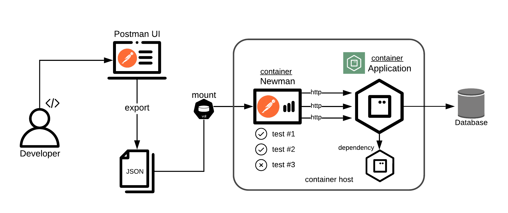

# Quarkus Project

[](https://github.com/juliaaano/quarkus/actions/workflows/ci.yml)
[](https://github.com/juliaaano/quarkus/actions/workflows/ci-native.yml)
[](https://github.com/juliaaano/quarkus/actions/workflows/scanning.yml)

This project uses [**Quarkus**](https://quarkus.io/), the Supersonic Subatomic Java Framework.

It showcases a diverse set of features and capabilities provided by the framework.

* HTTP REST API OpenAPI configured.
* Request input validation.
* Dependency injection.
* Database with PostgreSQL and Liquibase.
* OIDC/Oauth2/JWT handling with Keycloak.
* Docker, Kubernetes and OpenShift deployments.
* Unit testing (REST Assured, JUnit).
* Postman automated API testing.
* CI pipeline with [GitHub Actions](./github/workflows/quarkus.yml)
* Works on native mode.

## Running the application in dev mode

You can run your application in dev mode that enables live coding using:
```
$ mvn quarkus:dev
```

## Running the application with containers

Build and push of containers images are powered by Jib: https://quarkus.io/guides/container-image#jib.

See [application.properties](./src/main/resources/application.properties) for container image options.

Instructions require **docker** and **docker-compose** installed.

### Red Hat container registry login
```
$ docker login registry.redhat.io
```

### Run from the CI upstream image build
```
$ ./run.sh
```
Try the **native** or any other compatible image:
```
$ ./run.sh ghcr.io/juliaaano/quarkus-native:latest
```

### Build and run image locally:
```
$ ./build.sh && ./run.sh ghcr.io/juliaaano/quarkus:local
```

### Build and run by yourself

```
$ mvn clean package -Dquarkus.container-image.build=true
$ mvn clean package -Dquarkus.container-image.push=true
```

For **native** executable, add the extra option as seen next.

```
$ mvn clean package -Pnative -Dquarkus.native.container-build=true -Dquarkus.container-image.build=true
```

```
$ docker-compose up -d <docker-compose-service-names>
```

## Build and test a native executable

```
$ test-native.sh
```

## Running the application with OpenShift

These instructions are intended to be used in testing and development. A different and more comprehensive approach must be considered for CI/CD.

### JVM build

```
$ oc new-build --binary=true --docker-image=registry.redhat.io/ubi8/openjdk-11 --name=juliaaano-quarkus --labels="app=juliaaano-quarkus"
$ oc start-build juliaaano-quarkus --from-dir . --follow
```

### Native build

```
$ mvn clean package -Pnative -Dquarkus.native.container-build=true
$ oc new-build --binary=true --docker-image=quay.io/quarkus/ubi-quarkus-native-binary-s2i:1.0 --name=juliaaano-quarkus --labels="app=juliaaano-quarkus"
$ oc start-build juliaaano-quarkus --from-file ./target/juliaaano-quarkus-1.0-SNAPSHOT-runner --follow
```

### Deployment

```
$ oc apply -f manifests/
$ oc set image deployment juliaaano-quarkus app=$(oc get istag juliaaano-quarkus:latest -o jsonpath='{.image.dockerImageReference}')
$ oc scale deployment juliaaano-quarkus --replicas 2
$ oc expose service juliaaano-quarkus
$ curl "http://$(oc get route juliaaano-quarkus -o jsonpath='{.spec.host}')/q/health"
```

### Clean up

```
$ oc delete all -l app=juliaaano-quarkus
```

## Playing with the app

In Quarkus **DEV** mode, there is no security enabled, the API can be accessed from:

* http://localhost:8080/q/swagger-ui

As a container, the app runs in **PROD** mode along a set of other services, which can be found in the [docker-compose.yaml](./docker-compose.yaml) file.

Check out this awesome UI provided by Quarkus:

* http://localhost:8080/q/dev/

### Postman API testing

This project offers an automated setup of integration API testing with Postman.

Postman collections present in the [postman](./postman) folder can be imported and exported into the app and are automatically executed using docker-compose with [Newman](https://github.com/postmanlabs/newman) under the hood.



The **QUARKUS_APP_HOST** var points to the system under test and can be adjusted accordingly.

```
$ mvn quarkus:dev
$ QUARKUS_APP_HOST=http://localhost:8080 docker-compose run --rm postman
```

### Keycloak and JWT RBAC Security

When using docker-compose, a Keycloak realm is automatically imported, so tokens can be issued and used with the application as follows:

```
$ export access_token=$(\
    curl -X POST http://localhost:50102/auth/realms/quarkus/protocol/openid-connect/token \
    --user quarkus-api-test-client:"" \
    -H 'content-type: application/x-www-form-urlencoded' \
    -d 'username=bob&password=password&grant_type=password&scope=api.pets:read' | jq --raw-output '.access_token' \
)
$ curl -v http://localhost:8080/api/pets -H "Authorization: Bearer "$access_token

$ export access_token=$(\
    curl -X POST http://localhost:50102/auth/realms/quarkus/protocol/openid-connect/token \
    --user quarkus-api-test-client:"" \
    -H 'content-type: application/x-www-form-urlencoded' \
    -d 'username=alice&password=password&grant_type=password&scope=api.pets:read api.pets:write api.pets:erase' | jq --raw-output '.access_token' \
)
$ curl -v -X POST http://localhost:8080/api/pets -H "Authorization: Bearer "$access_token -H "Content-Type: application/json" -d '{"species":"bird","breed":"krakatoo"}'
```

## Misc

Test i18n localization:
```
curl -i -X PUT http://localhost:8080/api/pets/x -d '{}' -H 'Content-Type: application/json' -H 'Accept-Language: fr-FR'
```
